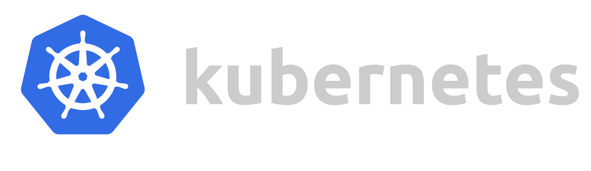

# DevOps Project - Microservice Architecture with Docker, Jenkins and Kubernetes 🐍 🐳🐋

Microservice Architecture with Docker, Jenkins and K8s.

Building scalable and automated microservices using Docker, Jenkins, and CI/CD pipeline.




## Table of Contents 📖

- [Overview](#overview)
- [Prerequisites](#prerequisites)
- [Set-up](#set-up)
- [Usage](#usage)
- [Architecture](#architecture)
- [Technologies](#technologies)
- [Developers Info](#developers-info)
- [License](#license)

## Overview 👀


This project is a full-stack application written in Python, leveraging Streamlit and FastAPI frameworks. It features a map-based interface on the front end and a backend with two endpoints. The application performs an API call to the International Space Station (ISS) to retrieve its current location and sends this information back to the front end, where it is visualized on a map.

## Prerequisites ⚙️

- <b>Docker</b> - is needed to build images.

    https://www.docker.com/

- <b>Minikube</b> - is needed for container-orchestration.

    https://minikube.sigs.k8s.io/

##  Set-up 🛠🧰

1. First clone the repository to your local system :

``` git clone https://github.com/adamK563/DevOpsProject```

2. Then to start the application simply write the command : 

``` docker-compose up ```

this will create 3 containers for frontend, backend and jenkins.


## Usage 📈

- To enter the Backend FastAPI UI - open your browser and enter the URL : 

   ``` localhost:8000/docs ```

- To enter the Frontend UI - enter URL : 

   ``` localhost:8501 ```

- To enter the Jenkins Pipeline/Jobs - enter URL : 

    ``` localhost:8080 ```

## Architecture 👷🏽

This project follows a microservice architecture. The main components of the architecture are:

Frontend: The frontend is built with Streamlit, providing an interactive map interface to view the real-time location of the International Space Station (ISS).

Backend: The backend is built with FastAPI, which fetches the ISS location data through an API call. The backend serves two endpoints.

Jenkins: Jenkins is used for continuous integration and continuous deployment (CI/CD) pipelines. The Jenkins pipeline is defined in a Jenkinsfile and is containerized using Docker.

Docker: Docker is used for containerization and deployment. Dockerfiles and Docker Compose are used to define and build the containers for the frontend, backend, and Jenkins.

Kubernetes: Kubernetes, specifically Minikube, is used for container orchestration. Minikube helps manage the deployment and scaling of the containers.

The combination of Docker and Jenkins facilitates the seamless deployment and automation of this microservice architecture. Dockerfiles and Docker Compose are utilized for containerization and deployment, while a containerized Jenkins Pipelines with a Jenkinsfile define the CI/CD processes.

```
+---------------------------------------------------------+
|                      User Interface                     |
|                    (Streamlit UI)                       |
+---------------------------------------------------------+
                           |
                           | REST API Requests
                           |
                           ▼
+---------------------------------------------------------+
|                      Backend API                        |
|                   (FastAPI Server)                      |
+---------------------------------------------------------+
                           |
                           | Docker Compose
                           |
                           ▼
+---------------------------------------------------------+
|                    Docker Containers                    |
|            (Frontend, Backend, Jenkins)                 |
+---------------------------------------------------------+
                           |
                           | Container Orchestration
                           |
                           ▼
+---------------------------------------------------------+
|                     Kubernetes Cluster                  |
|                      (Minikube)                         |
+---------------------------------------------------------+
```

## Technologies 💻

- Backend:
  - FastAPI
  - Uvicorn
  - REST API
  - API requests  
- Frontend:
  - Streamlit
  - Pandas
  - Json 
- Jenkins:
  - CI/CD Pipline
  - Jenkins (Docker) Contaner 
  - Jenkins Job
- Docker:
  - Containers
  - Images
  - Docker Compose
- Kubernetes:
  - Minikube
  - Pods
- Version Control:
  - Git
  - GitHub

## Developers Info💻:

### Adam Karpovich 👨🏼‍💻
- Github - [adamK563](https://github.com/adamK563)
- Linkedin - [Adam Karpovich](https://www.linkedin.com/in/adam-karpovich-26038a206/)
        
### Veronika Kovaleva 👩🏽‍💻
- Github - [veronika8597](https://github.com/veronika8597)
- Linkedin - [Veronika Kovalev](https://www.linkedin.com/in/veronika-kovalev-5a2a40178/)

### Sergey Gershov 🧑🏽‍💻
- Github - [SergeyGers](https://github.com/SergeyGers)
- Linkedin - [Sergey Gershov](https://www.linkedin.com/in/sergey-gershov-591370175/)

## License 👌🏽⚖️

This project is licensed under the [MIT License](LICENSE).

The MIT License is a permissive open-source license that allows you to freely use, modify, and distribute this project for both commercial and non-commercial purposes. You are granted the rights to use the software "as is" without any warranties or conditions of any kind.

For more details, please refer to the [LICENSE](LICENSE) file.


